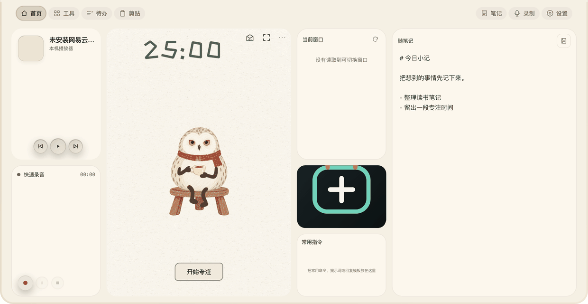
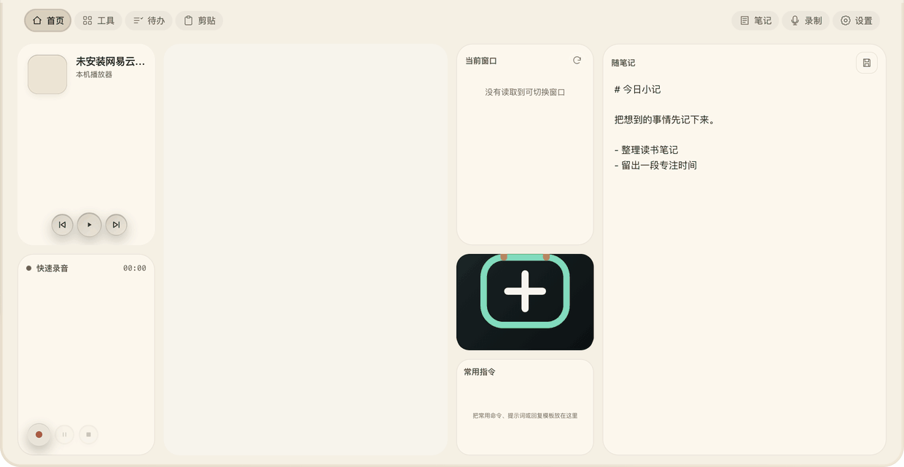
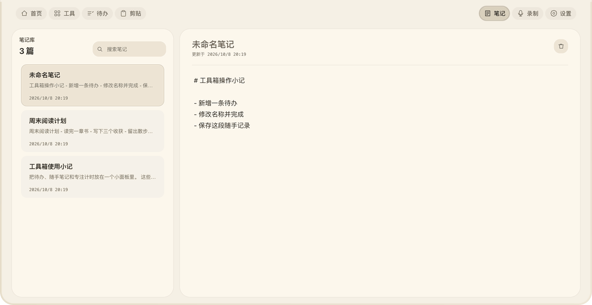
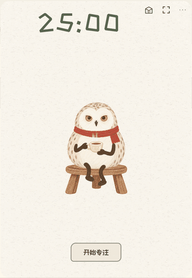

# IRiXi的小工具库

项目创作者：**[IRiXi](https://github.com/Irixil)**（GitHub：Irixil）。原始仓库：[Irixil/IRiXi-Toolbox](https://github.com/Irixil/IRiXi-Toolbox) · [作者与推荐署名](ATTRIBUTION.md)。

一个放在 Mac 屏幕顶部的个人工具箱。点击顶部入口，展开奶油色工作台，就能记待办、写笔记、找剪贴内容、截图识字，或者让红围巾猫头鹰陪你专注一会儿。用完收起，继续手头的工作。

工具箱外层采用平整的奶油米色与黑字。嵌入首页的猫头鹰番茄钟保留自己的原配色和细微纸纹。



[查看静态预览](docs/media/overview.png) · [演示制作与验证范围](docs/demo-provenance.md)

> 当前源码版本为 **0.4.18**，已包含随时保存下一轮时长、直接开始下一轮和自然完成后的桌面提示。仓库目前提供源码，**没有公开的可直接安装签名包**。GIF 使用真实界面和独立演示数据，录制方法见上方说明。

## 能做什么

| 页面或模块 | 当前功能 | 从哪里开始 |
| --- | --- | --- |
| 首页 | 猫头鹰番茄钟、网易云音乐、当前窗口、镜子、随笔记、常用指令、快速录音。组件可拖动排列，切换迷你、小、中、大尺寸，也可隐藏 | 点击顶部入口，在首页使用组件；显示与隐藏在设置里调整 |
| 工具 | 查看、搜索和开关内置工具；打开输入翻译、截图与识字；安装、停用和卸载随附计数器示例 | 进入「工具」，选中左侧条目，在右侧查看说明或打开 |
| 待办 | 四类任务，可改分类名称、修改内容、设截止时间、标记完成和删除；显示剩余时间比例并提醒到期任务 | 在对应分类输入任务，回车保存 |
| 剪贴 | 本机文本、链接和图片历史；类型筛选、收藏、复制与回到原应用粘贴 | 先在设置开启「剪贴板」，再进入「剪贴」 |
| 笔记 | 首页随笔保存到笔记库；搜索、改名、编辑、删除；常用指令在首页另有保存与复制卡片 | 首页写完点「保存」，或直接进入「笔记」 |
| 录制 | 麦克风录音、音频资料库、回放和转写文本；配置 API 后可实时转写 | 首页录音卡片或「录制」页 |
| 设置 | 页面和首页组件开关、镜子封面、唤出与区域截图快捷键、开机启动、数据文件夹入口、转写和模型配置 | 进入「设置」 |

### 写待办，随手记下想法

四类待办默认叫「课程」「自媒体&写作」「Vibe coding」「日常」，名称可以自己改。任务写完按回车，点任务内容可以修改，点圆形勾选按钮标记完成。设置截止时间后，任务会显示剩余时间比例；到期提醒需要应用运行。

首页的随笔记适合临时记下一段话，保存后能在笔记库继续编辑。首页还提供常用指令卡片，适合存重复使用的提示词或文本。



[查看静态预览](docs/media/workflow.png)

### 找回刚才复制的内容

剪贴板历史默认关闭，开启后开始记录新的复制内容。进入剪贴页，可以筛选文字、图片或收藏，把常用内容收藏起来。点击历史项可尝试回到展开工具箱前的应用粘贴；自动粘贴需要辅助功能权限。



[查看静态预览](docs/media/clipboard.png)

### 猫头鹰番茄钟

番茄钟是工具箱首页里的一个嵌入式小窗口。填写这次的一件事，开始专注，也可以暂停、继续或结束。

- 在「更多 → 下一轮设置」里调整专注和休息分钟数，点「保存下一轮时长」。运行中或暂停中也能保存，当前轮的时长与已计进度保持。
- 想立即换一件事，点「开始下一轮」。上一轮即使还没完成，也能直接切到新一轮；只保留实际有效专注时间，未完成的时间不会补算。
- 一轮专注自然完成后，即使工具箱已经收起，也会显示桌面完成卡片，告诉你刚刚成功专注了多久。它随机播放一种同色系手绘庆祝，8 秒后自动收起，也可点关闭；不会自动展开工具箱或抢走键盘焦点，没有新增提示音。提前换轮和手动结束不会触发完成庆祝。
- 专注积累可以获得收藏。打开收藏箱试摆灯、植物、地毯、挂画和家具，适用道具可拖动、缩放、镜像和调整前后次序。点「放好」保存整组，点「取消」恢复原搭配。
- 「全道具体验（测试）」单独保存体验布置，关闭后恢复正常装扮，不增加真实专注时间或永久收藏。也可开启「减少动效」。

下图只截取首页中的番茄钟区域，便于看清设置。



[查看静态预览](docs/media/focus.png) · [桌面完成反馈与七种效果](docs/desktop-completion.md)

工具箱内的番茄钟与[独立猫头鹰番茄钟](https://github.com/Irixil/irixi-owl-focus)各用自己的存档。前台 APP 时间记录默认关闭，可在番茄钟「更多」中主动开启，仅保存应用与时长。

### 截图、识字与翻译

「工具 → 截图与识字」提供区域、窗口和全屏截图，配有原生标注编辑器，可复制、保存与钉图；识字使用 Apple Vision。图片翻译、输入翻译和划词翻译使用 Apple 本机翻译，需要 macOS 15 或更高版本，并按系统提示准备对应语言。

输入翻译支持中英、中日、中韩互译及英文朗读。默认区域截图快捷键是 **⌘⇧X**，跨应用划词翻译是 **⌃⌥Y**。工具箱的「录制」页目前用于麦克风录音。

可选的 Codex 联网解释需要本机已安装 Codex 并用 ChatGPT 账号登录，账号须能使用当前指定的 `gpt-5.6-luna` 模型；解释使用独立临时会话；它与 Apple 本机翻译是两条不同路径。

### 网易云音乐与镜子

首页音乐卡片可显示网易云音乐当前歌曲、封面和跟随播放进度高亮的歌词，支持上一首、播放／暂停、下一首。需要本机安装并运行网易云音乐，部分控制依赖 macOS 权限；当前没有可拖动的进度条或点击歌词跳转。

镜子可以显示自选封面，也可以主动开启相机预览。离开首页或收起面板会停止相机预览。

## 安装与第一次使用

### 系统要求

| 项目 | 要求 |
| --- | --- |
| 设备 | Apple Silicon Mac，当前构建目标为 arm64 |
| 系统 | macOS 13 或更高版本 |
| Apple 翻译相关功能 | macOS 15 或更高版本 |
| 网易云音乐卡片 | 本机安装并运行网易云音乐 |
| 实时语音转写 | 配置自己的通义百炼 API，使用时需要网络 |
| 智能命名与分组 | 可选配置 DeepSeek 或兼容模型 API |

**目前没有一键下载的公开安装包。** 如果你已经有可信来源的签名应用，将「IRiXi的小工具库.app」放进「应用程序」并打开即可。想从本仓库运行，需要按后面的源码构建步骤准备环境；仓库不含维护者的签名证书。

1. 打开应用后，点击屏幕顶部入口展开；菜单栏图标可恢复隐藏的顶部入口。默认空格唤出需先把鼠标移到收起入口，也可在设置中改为组合快捷键。
2. 顶部导航进入首页、工具、待办、笔记、录制和设置。剪贴默认关闭，开启后才显示相应入口。
3. 点组件的尺寸按钮切换大小，长按约半秒后拖动组件调整排列；不常用的组件可在设置中隐藏。隐藏组件后，其余组件会自动填满布局，尺寸按钮暂不显示。
4. 按 **Escape** 或点击外部应用收起。输入框里按 Escape 会先退出输入，选中内容时会先清除选择；输入框里的空格仍用于输入文字。

### 按需授予权限

在 macOS「系统设置 → 隐私与安全性」中，按实际要用的功能授予权限。不同系统版本的权限名称可能略有区别。

| 权限 | 用途 |
| --- | --- |
| 屏幕录制／屏幕与系统音频录制 | 截图、识字、图片翻译以及当前窗口读取 |
| 辅助功能 | 跨应用划词、窗口切换、剪贴自动粘贴及部分音乐控制 |
| 自动化 | 允许工具箱按系统提示访问系统事件、音乐应用等 |
| 麦克风 | 主动开始录音 |
| 相机 | 主动打开镜子预览 |

如果授权后功能仍不可用，先退出并重新打开同一份应用。截图与翻译依赖配套原生模块，单独复制 Electron 页面不能替代完整构建。

## 数据与联网

待办、笔记、剪贴历史、录音和番茄钟存档保存在本机。设置里的「数据文件夹 → 在访达打开」可以找到工具箱数据；默认关闭剪贴历史和前台 APP 记录，需要主动开启。

截图识字和 Apple 翻译在本机处理。启用实时转写会把音频发送到你配置的通义百炼服务；配置智能命名与分组后，笔记或转写文本可能发送到配置的模型。音乐封面、歌词和 Codex 联网解释也会访问网络。API Key 使用 macOS 安全存储，仓库不包含密钥。

本地 `.irixi-tool` 示例当前只允许自己的独立存储，不能联网、读取任意文件或控制电脑，界面格式目前限于计数器。

## 从源码运行与开发

需要 **Xcode 26 或更高版本**、**Node.js 22.12 或更高版本**，以及本机可用的稳定代码签名身份。先克隆本仓库，在仓库根目录运行以下命令。

```bash
git clone https://github.com/Irixil/IRiXi-Toolbox.git
cd IRiXi-Toolbox
./scripts/prepare.sh
cd app
npm test
npm run pack
```

`prepare.sh` 构建 `IRiXiNativeKit.framework`，安装所需依赖并暂存原生桥接模块。若提示缺少 `node_api.h`，用 `IRIXI_NODE_HEADERS` 指向与本机 Node 对应的头文件目录。打包结果位于 `app/dist.noindex/`，打开其中构建出的应用进行本机检查。

`npm run pack` 会检查稳定签名身份，没有可用身份会停止。可通过 `IRIXI_CODESIGN_IDENTITY` 指定自己已有的身份名称或证书指纹；本机签名不等于可公开分发的 Developer ID 签名与公证。`npm start` 是源码开发入口，权限与原生模块检查仍应使用完整的稳定签名包。

```text
IRiXi-Toolbox/
├── app/
│   ├── main.js、preload.js   # Electron 宿主与安全桥接
│   ├── renderer/            # 工具箱页面与样式
│   ├── owl/                 # 内嵌猫头鹰界面、计时核心与存档
│   ├── native/              # 原生模块桥接
│   ├── bundled-tools/       # 本地计数器示例
│   └── tests/               # 自动检查与隔离 Electron 检查
├── snaploom/                # 截图、OCR、翻译的 Swift 原生源码
├── scripts/prepare.sh       # 组装原生模块与应用依赖
└── docs/                    # 演示资产与开发、验证说明
```

GIF 展示的是当前真实页面在独立演示环境中的操作。权限、联网服务、长期后台运行以及所有设备兼容性没有通过这些 GIF 重新验收；已有本机计时与界面检查的具体边界保留在[历次验证记录](docs/validation-history.md)。

项目源码采用 [GPL-3.0-only](LICENSE)，与 `app/package.json` 的许可标识一致。[作者与推荐署名](ATTRIBUTION.md)、[猫头鹰素材与来源](app/owl/docs/assets.md)及[第三方说明](THIRD_PARTY_NOTICES.md)提供溯源入口，原有许可证随源码保留。
