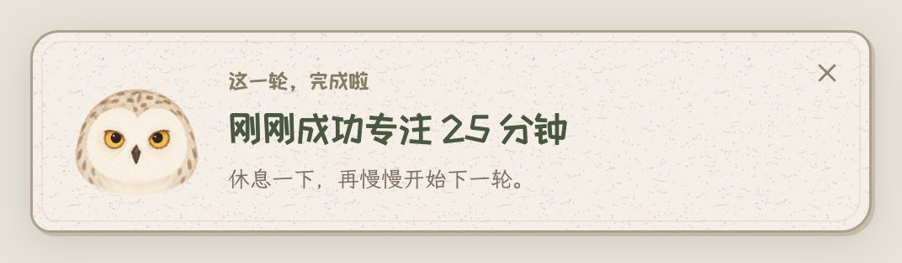
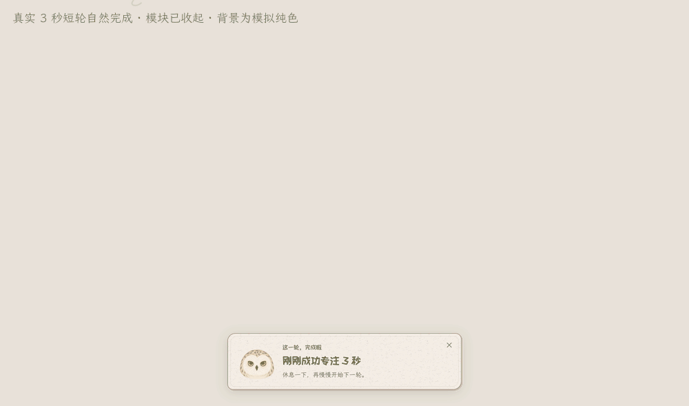
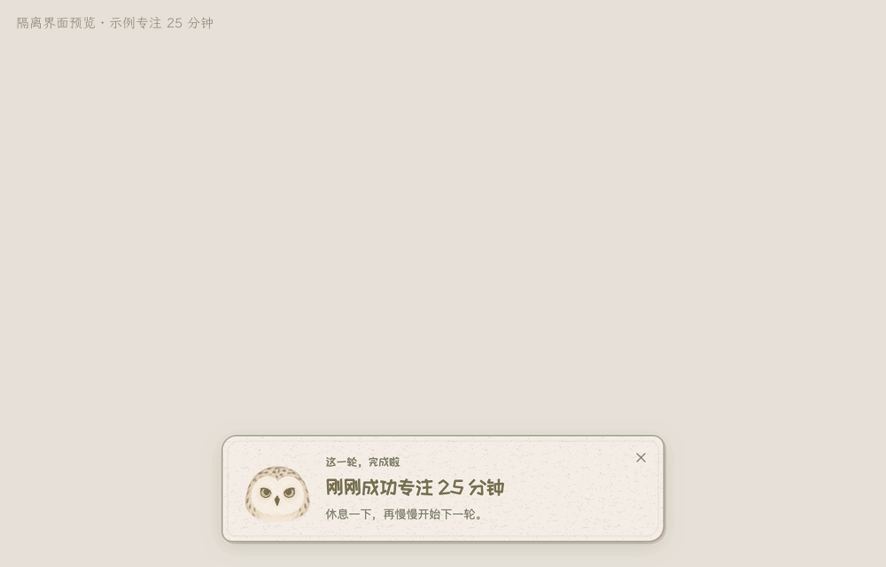
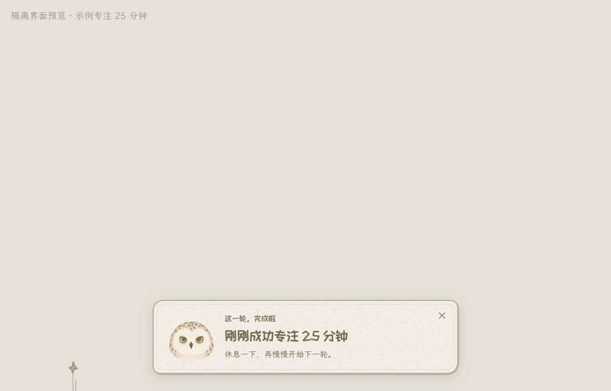
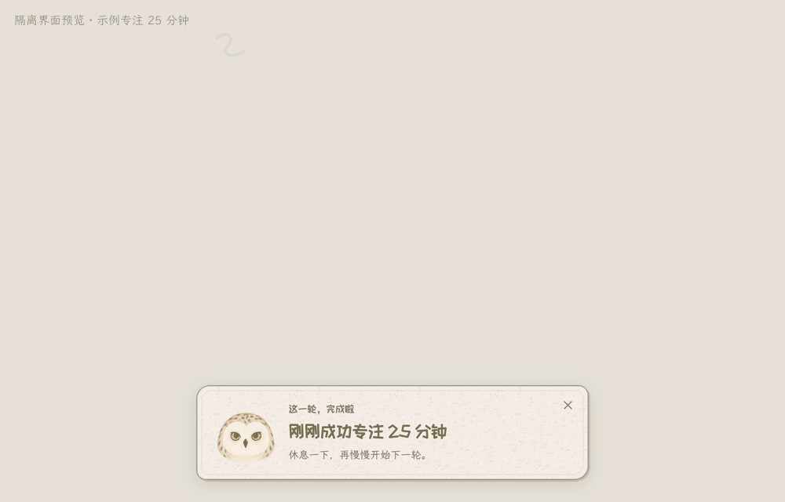
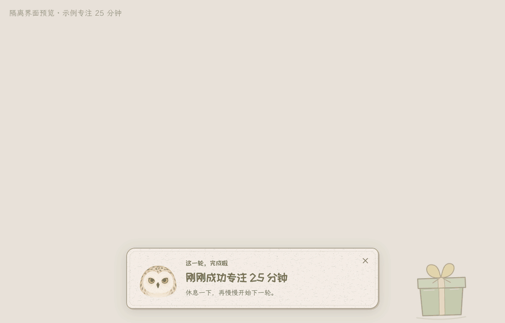
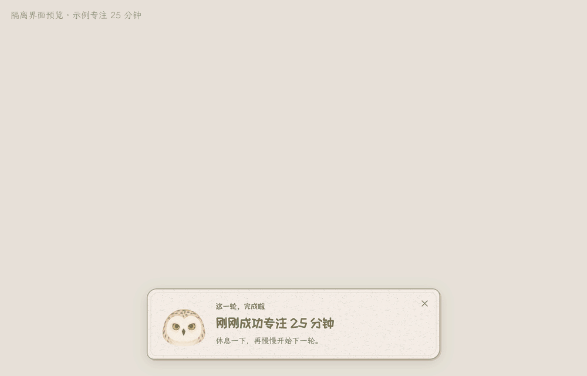
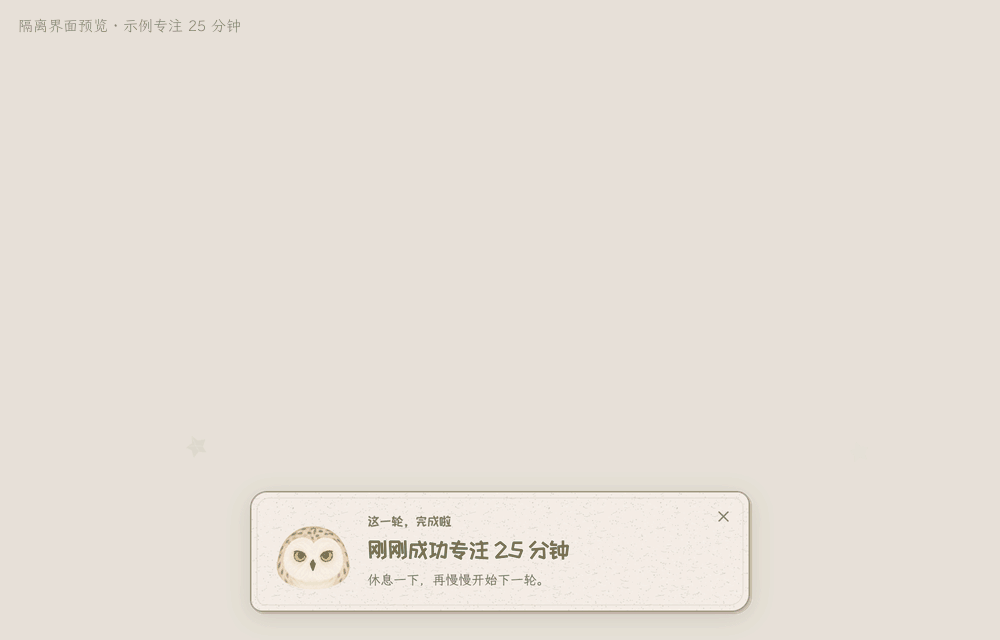
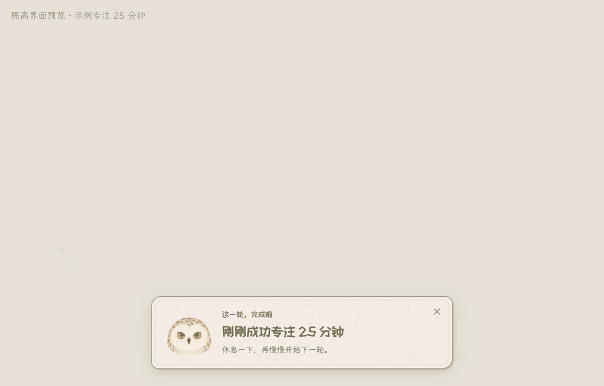

# 专注完成后的桌面提示

一轮专注自然完成并保存后，桌面会出现“刚刚成功专注 X 分钟”的卡片。工具箱收起、番茄钟模块隐藏时也会提示。卡片使用番茄钟现成的猫头鹰头像，保留原来的羽毛纹理、黄色眼睛和比例。



上图的 25 分钟是合成演示文案。下图来自隔离存档中真实运行的 **3 秒短轮**：生产计时服务自然完成，模块已隐藏，完成卡片显示实际计入时长。背景是用于保留透明像素的模拟纯色，没有录制桌面内容。



[静态图](media/completion/natural-completion.png)

## 七种小奖励

每次随机选择一种，避免与上一次相邻重复。动画约 4 秒，文字卡片保留约 8 秒，也可点右上角关闭。没有新增声音，不会展开工具箱或抢走键盘焦点。下面是实际运行中的 UI 帧，使用合成 25 分钟完成文案；它们不代表跑完了七轮 25 分钟计时。

| 纸流星，从右上角划过 | 小烟花，从屏幕下缘升起 |
| --- | --- |
|  |  |
| [静态图](media/completion/completion-meteors.png) | [静态图](media/completion/completion-fireworks.png) |

| 彩带，从左上角飘落 | 礼盒花瓣，从右下角打开 |
| --- | --- |
|  |  |
| [静态图](media/completion/completion-ribbons.png) | [静态图](media/completion/completion-flowers.png) |

| 花瓣雨，轻轻飘落 | 纸星星，在边缘散开 |
| --- | --- |
|  |  |
| [静态图](media/completion/completion-petals.png) | [静态图](media/completion/completion-paper-stars.png) |



[小花绽放静态图](media/completion/completion-blooms.png) · [七种效果静态总览](media/completion/seven-effects.jpg) · [帧来源与文件摘要](media/completion/manifest.json)

## 使用时的几个细节

- 提前换轮、手动结束、暂停、休息结束不会触发专注完成庆祝。保存失败时也不会宣称完成。
- 完成文案来自刚结束的那一轮，分钟和余秒都按实际计入时长显示；不会使用累计总时间或下一轮设置。
- 选择“减少动效”或启用系统减少动态效果后，会保留静态头像和完成文字。
- 锁屏或登录会话离开时不展示浮层。若这期间自然完成，提示会等到解锁和会话恢复后显示一次；已展示的提示不会因锁屏而重放。
- 休眠和异常长间隔沿用原来的暂停规则，休眠时间不补算，唤醒后需要手动继续。
- 浮层选择鼠标所在屏幕的可用区域；透明部分可继续点击下面的应用。它使用系统提供的窗口接口，无需新增录屏、辅助功能或通知权限。

## 实现与检查范围

完成信息由唯一的主进程计时服务在保存成功后发出。每轮带有独立 ID 与准确时长，桌面浮层只消费这个事件，不写专注存档、不发放收藏、不创建第二套计时器。关闭浮层不会改变下一轮或累计进度。

已完成 174 项 Node 回归，包括自然到点、到点同时换轮、提前换轮、失败保存、重复事件、七种随机效果与相邻去重、减少动态效果、锁屏与休眠组合、多屏位置和加载竞态。最终签名包中的生产代码与 UI 还通过隔离 Electron 检查：模块隐藏后真实短轮自然完成、8 秒收起、关闭按钮、七种实际效果及结束后的清理，以及头像像素与现有素材等比缩小结果完全一致。窄屏与矮屏会缩紧卡片，透明区域继续允许点击下面的应用；没有读取其他应用的输入位置。

当前 Mac 上另做了一次原生可见性检查：系统窗口列表确认浮层在屏幕上，前台应用保持原样。Space、全屏应用、物理多屏、真实锁屏和整夜休眠没有在本次逐项实屏验收；相关事件与位置规则已做模拟回归，不能据此宣称全部设备和长期场景通过。接口依据：[Electron 窗口接口](https://www.electronjs.org/docs/latest/api/browser-window)、[系统电源与锁屏事件](https://www.electronjs.org/docs/latest/api/power-monitor)。

原头像复用 `app/owl/ui/assets/motion-v7/head-poses.png` 首格，尺寸为 418 × 418，等比绘制，没有重绘、变色或生成替代角色。原素材摘要与正式源码一致；历史发布元数据保留原样，仅作为旧版记录，不能当作本次验收结论。

开发环境可运行：

```sh
cd app
npm run test:owl-completion
```

默认检查使用临时存档并隐藏窗口，不读取真实待办、剪贴板、收藏或轮次。`TEST_APP_SOURCE` 可指定候选 `app.asar`；只有显式设置 `IRIXI_COMPLETION_VISIBLE=1` 才会让测试浮层显示在桌面上。公开源码不包含本机私有旧验收脚本，也没有公开签名安装包。
